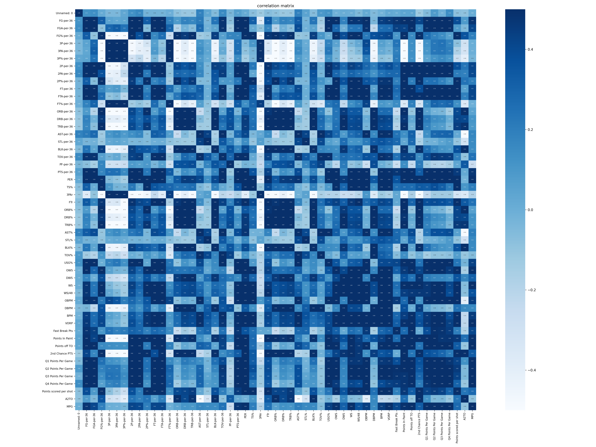
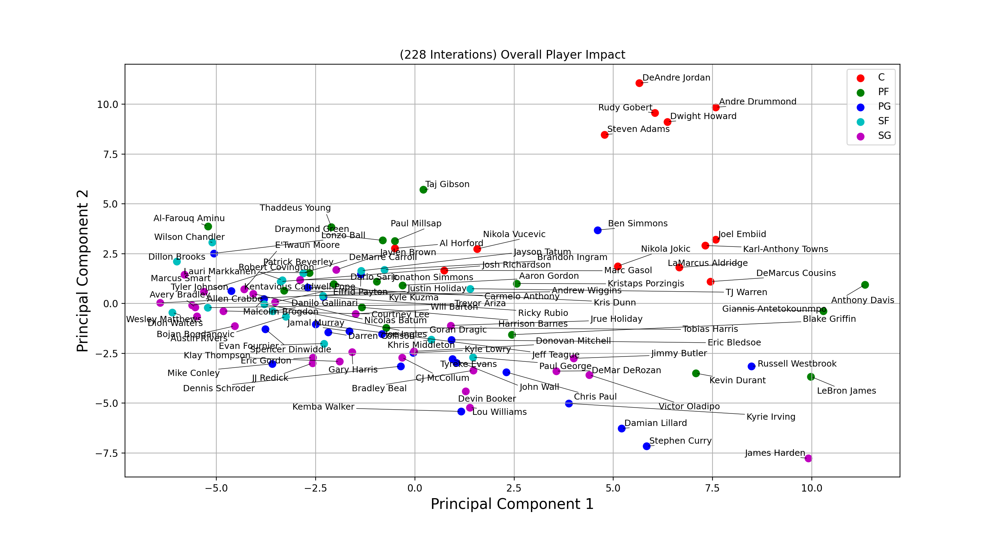
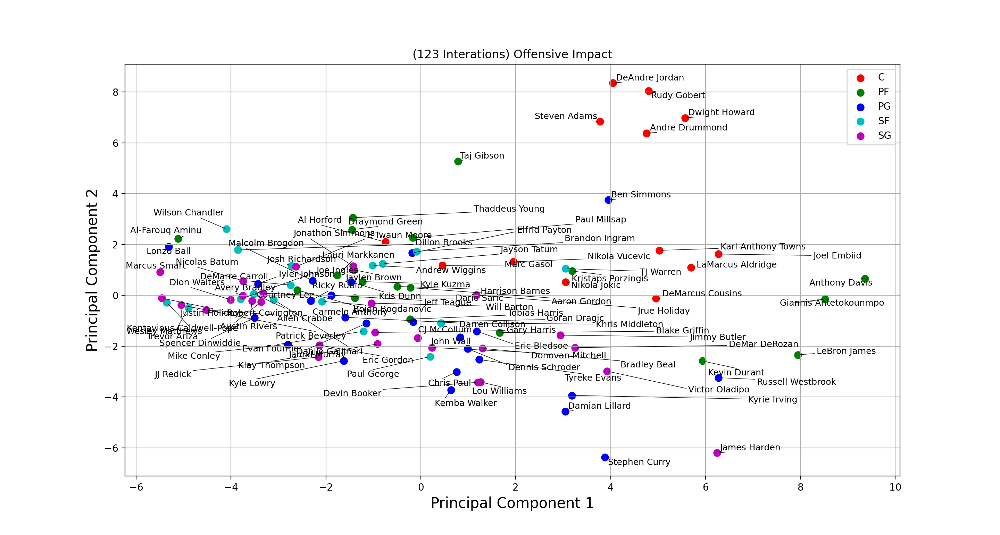
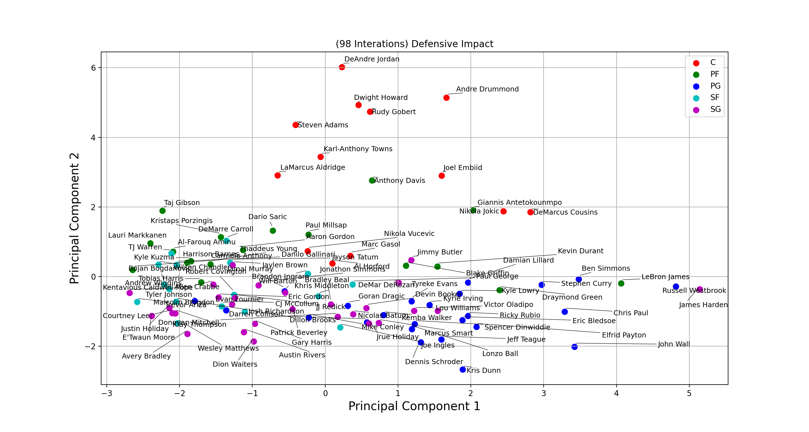
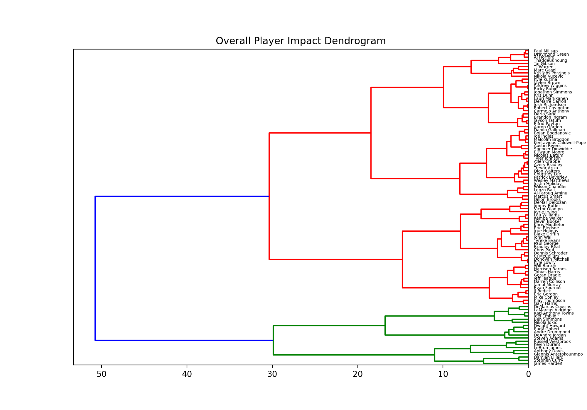

# NBA-Player-Similarity Part 1. Mordern Era.

This report is broken up into two parts. The first part will be focused on looking at modern players. Specifically players from the 2017-18 NBA regular season. I will be exploring the similarities between players through a range of machine learning techniques and visualizing this data. The second part is going to be focused on comparing modern players to players from previous errors. Think Larry Birds Celtics, Magic Johnsons Las Angeles Lakers, and Michael Jordans Chicago Bulls. The first half of the report will be more detailed on the methods used and explaining how and why the work. Whereas the second part will be more focused on drawing different conclusions based on the data which is discovered. 

## The Problem

There isn't any particular problem I'm looking to solve. However, without a specific goal, there is still plenty we can learn from an open-ended project. I will be looking at players from the 2017/2018 NBA season and looking for differences/similarities between them. To see if stats measure up to what fans and pundits hold up as truths about NBA players. NBA in recent years has become significantly more analytical, however, not everything can be measured with statistics, and looking at individual stats in a game with 4 other players on the court only gives a fragmented view of the bigger picture. But even with this limitation, we can still gain insight through statistics. I hope to come to some conclusions that we couldn't have reached by merely glancing at the data, and hopefully find some interesting information about players.

## Data-Sets

I'm going to using player data from the 2017-18 NBA regular season. The final data-set will be made up of three separate data-sets which have been obtained from the websites, Basketball-reference and NBAminer. The first data-set from Basketball-reference is made up of the more traditional statistics (think points, rebounds assists). The player statistics have been normalized to 36 minutes of game-time as opposed to looking at per-game averages. The reason for normalizing by minutes-per-game is that it gives a fairer representation of each player's contributions. If we looked at per-game statistics instead of per-36 players who play more minutes like LeBron James would look much better on paper then players like Steph Curry who play fewer minutes because his team is much better. A player like Steph Curry often isn't required to play the end of a game because he is on the bench being rested. There's an argument to be made that this is unfair to players who play more minutes and that Lebron would possibly put up better per 36 numbers if he played fewer minutes like Curry and wasn't forced to player longer increasing his exhaustion. Other stats like per-100-possessions exist which could be argued are better for evaluating a player's impact, as they normalize a player's stats by the team's pace. However, I think that statistic also has its drawbacks as it reduces the impact of players who aren't go-to scoring options and therefore don't get used to possessions where the team is required to score in a rush. Unfortunately, there isn't a perfect statistic that can rid of all bias. What we can do is try our best to minimize them and be conscious of them when evaluating our results.  The second basketball-reference data-set we are using is made up of 'Advanced' statistics (think usage %, rebound %, FG%) from the same group of players as the first data-set. The third data-set is from a smaller website called NBAminer. This data-set has some more miscellaneous statistics (think points in the paint, fast breakpoints). These stats offer useful insight that traditional statistics do not offer. They don't just say that points were scored, but positions on the court where they were scored. 

## Pre-processing: Data-cleaning

***Merging data-sets and fixing mismatches***. Because the first two data-sets are from the same source merging these two are easy. The third datasets are from a different source so some discrepancies need to be addressed. The first thing is that there is information on 19 fewer players. Looking deeper we can see that 45 total players don't have any data on the third. There are some small things we can do to reduce this number. In data-set one and two they have special characters for player names. For example, J.J Barea, where are in the third these special characters have been removed. The solution is to remove the special characters from the first two data-sets. Some players have Suffixes or numerical values in their name (ex: IV) or (ex: Jr) these are also removed from the first two data-sets before we merge. The remaining names which are missing are players that have very limited minutes for very few games. I'm not going to add these players because they'd have been anyway.

***Removing Features***. After merging the data-sets, repeated features need to be removed (ex: player name repeated). After this, we need to remove redundant features (ex: team name). We also remove features such as ranking, it's a meaningless indexing variable. Finally, we also remove points-per-quarter for all four quarters. The reason for this is because they are not normalized per-36 which isn't in line with our other attributes. 

***Feature Extraction***. After removing redundant features there are two more important features that we can extract. The first one is minutes-per-game. This can be calculated by taking the total minutes played (MP) and the total games played (G) and dividing these two numbers. This value will be used later to subset the data. The second is the Assist-to-turnover ratio. This metric is a good indicator of how careless a player is with the ball on offense.

***Missing Values***. The only features which have missing values are 3P%, 2P%, FT%, and TS%. After sub-setting our data-set, the only feature which has missing values is 3P%. The value is missing because there are players who have not attempted a single 3 pointer in the whole season. With this being the case, I'm going to replace the value with 0%. It seems reasonable to assume that if a player has not attempted a single 3 pointer, their shooting skills are probably similar to others who have attempted but not made a single 3 pointer throughout the season. After subsetting the data there are only 2 rows that are missing values. Replace these with 0.0 manually. 

***Sub-Setting Data***. The goal of this project is to make comparisons between players who make significant contributions to games. Therefore I'm going to remove players who do not play a significant amount of minutes per game. By doing this it will reduce clusters from getting to cluttered. I'm going to sub-set the data based on the value which was created previously, minutes per game. If a player has less then 28.5 minutes per game they will be removed from the data-set. By doing this the data-set is reduced to 100 players. After combining the 3 tables, feature-engineering, and sub-setting our data, we have data on 104 players with the following 51 features:

1. **Player** - Player name
2. **Pos** - Position
3. **G** - Games Played
4. **MP** - Minutes Played In A Season
5. **FG** - Field Goals Per 36 Minutes
6. **FGA** - Field Goals Attempted Per 36 Minutes
7. **FG**% - Field Goal Percentage
8. **3P** - 3-Pointers Made Per 36 Minutes
9. **3PA** - 3-Pointers Attempted Per 36 Minutes
10. **3P%** - 3-Point Percentage
11. **2P** - 2-Point Field Goals Per 36 Minutes
12. **2PA** - 2-Point Field Goals Attempted Per 36 Minutes
13. **2P%** - 2-Point Field Goal Percentage
14. **FT** - Free-Throws Made Per 36 Minutes
15. **FTA** - Free Throws Attempted Per 36 Minutes
16. **FT%** - Free Throw Percentage
17. **ORB** - Offensive Rebounds Per 36 Minutes
18. **DRB** - Defensive Rebounds Per 36 Minutes
19. **TRB** - Total Rebounds Per 36 Minutes
20. **AST** - Assists Per 36 Minutes
21. **STL** - Steals Per 36 Minutes
22. **BLK** - Blocks Per 36 Minutes
23. **TOV** - Turnovers Per 36 Minutes
24. **PF** - Personal Fouls Per 36 Minutes
25. **PTS** - Points Per 36 Minutes
26. **PER** - Player Efficiency Rating- A measure of per-minute production standardized such that the league average is 15.
27. **TS%** - True Shooting Percentage- A measure of shooting efficiency that takes into account 2-point field goals, 3-point field goals, and free throws.
28. **3PAr** - 3 Point Attempt Rate- Percentage of FG Attempts from 3-Point Range
29. **FTr** - Free Throw Attempt Rate- Number of FT Attempts Per FG Attempt
30. **ORB%** - Offensive Rebound Percentage- An estimate of the percentage of available offensive rebounds a player grabbed while he was on the floor.
31. **DRB%** - Defensive Rebound Percentage- An estimate of the percentage of available defensive rebounds a player grabbed while he was on the floor.
32. **TRB%** - Total Rebound Percentage- An estimate of the percentage of available rebounds a player grabbed while he was on the floor.
33. **AST%** - Assist Percentage- An estimate of the percentage of total assists a player had while he was on the floor.
34. **STL%** - Steal Percentage- An estimate of the percentage of total steals a player had while he was on the floor.
35. **BLK%** - Block Percentage- An estimate of the percentage of total blocks a player had while he was on the floor.
36. **TOV%** - Turnover Percentage- An estimate of turnovers committed per 100 plays.
37. **USG%** - Usage Percentage- An estimate of the percentage of team plays used by a player while he was on the floor.
38. **OWS** - Offensive Win Shares- An estimate of the number of wins contributed by a player due to his offense.
39. **DWS** - Defensive Win Shares- An estimate of the number of wins contributed by a player due to his defence.
40. **WS/48** - Win Shares Per 48 Minutes- An estimate of the number of wins contributed by a player per 48 minutes (league average is approximately .100.
41. **OBPM** - Offensive Box Plus/Minus- A box score estimate of the offensive points per 100 possessions a player contributed above a league-average player, translated to an average team.
42. **DBPM** — Defensive Box Plus/Minus- A box score estimate of the defensive points per 100 possessions a player contributed above a league-average player, translated to an average team.
43. **BPM** — Box Plus/Minus- A box score estimate of the points per 100 possessions a player contributed above a league-average player, translated to an average team.
44. **VORP** - Value over Replacement Player- A box score estimate of the points per 100 TEAM possessions that a player contributed above a replacement-level (-2.0. player, translated to an average team and prorated to an 82-game season.
45. **Fast Break Pts** - Fast break points per game
46. **Points in Paint** - Points Scored in Paint per game
47. **Points off TO** - Points Scored Off Turnovers per game
48. **2nd Chance Points** — Any points scored during a possession after an offensive player has already attempted one shot and missed
49. **Points Scored per Shot** — Calculated by dividing the total points (2P made and 3P made. by the total field goals attempts.
50. **A2TO** - Assists to turnover ration
51. **MPG** - Minutes Played per game

## Methods for Data Analysis

Im going to be using three different statistical methods for analysising the data.

1) Principle Component Analysis
2) Hierarchical Clustering
3) K-means Clustering

For each method, I am are going to compare the players in terms of Overall impact. In some cases I will also be looking at offensive and defensive impact. This will be done by excluding stats which don't impact the defensive side of the game.

***Overall Impact Calculations*** 

For *Overall Impact* calculations, we will be looking at features 5:51. I'll be ignoring features like total season minutes and games played because we don't want to seperate players who may have missed games due to injuries. There will be no catagorical variables but these will be used when looking at the results. For *Offensive Impact* calculations, I am going to be looking at the following features: 5:16, 19, 22, 50, 25:28, 31, 33:35, 43:47, 49. In regards to *Defensive Impact* calculations im going to be looking at the features: 17, 20, 21, 36, 29, 32, 33, 37, 40.

Before applying any statistical methods it seems wise to have a look at a correlation plot between the features to see if there is anything interesting. The below image is that correlation matrix with the highest DPI I can manage. Pretty much everything is as we expect to see. For example Second Chance Points positively correlate with Offensive Rebound %, and 3-pointer Attempt Rate negatively correlates with Points Score in the Paint. Nothing in this is super interesting but it is an easy way to visualize all the data. 

## Method 1: Principal Component Analysis (PCA)

The Wikipedia article summarizes Principal Component Analysis as:
“A statistical procedure that uses an orthogonal transformation to convert a set of observations of possibly correlated variables (entities each of which takes on various numerical values) into a set of values of linearly uncorrelated variables called principal components. If there are n observations with p variables, then the number of distinct principal components is minimum (n-1,p). This transformation is defined in such a way that the first principal component (PC1) has the largest possible variance (that is, accounts for as much of the variability in the data as possible), and each succeeding component in turn has the highest variance possible under the constraint that it is orthogonal to the preceding components. The resulting vectors (each being a linear combination of the variables and containing n observations) are an uncorrelated orthogonal basis set.”

Principal Component Analysis is a mathematical technique used for dimensionality reduction. Its goal is to reduce the number of features whilst keeping most of the original information. The reason I'm using PCA is that it makes visualization if a large number of features possible. Imagine you have a data-set of 10 features and want to visualize it. How? 10 features = 10 physical dimensions. Humans kind of suck when it comes to visualizing anything above 3 dimensions - hence the need for dimensionality reduction techniques. 
To explain PCA in a simple way. The goal is to get 2 main principal components from our data-set. What this means is we take all the features which that we are studying, combining them, and extracting 2 NEW features that represent a combination of the previous features. These new principal components are the best possible combination of 2 features for numerically conveying differences between players. I will also be doing a PCA on the Offensive/Defensive impact of the players in our data-set. The first up is the Overall Player Impact. 

The above plot speaks volumes about the players in our data. The first thing we can see is that if you were to draw a line around the bottom right-hand corner or players it would encapsulate 8 out of the last 9 NBA scoring leaders for a given season. These players are Lebron James, James Harden, Stephen Curry, Russell Westbrook, and Kevin Durant. Unsurprisingly, these 5 players are the last 5 MVPs of the regular season. None of this is particularly revolutionary. The most notable thing of these groupings of players in the proximity of Damian Lillard to this elite group of players. It should be noted that in the 2017-18 season when this data was taken Damian Lillard was a disrespected player in the league. With the power of hindsight, we know that Damian Lillard is a superstar in the NBA and this graph shows that during the 17-18 season he should've been recognized alongside the most elite talent in the NBA.

Note; that players are color-coded by their traditional position. The issue with this is that we are in the era of positionless basketball as position responsibilities continuously evolve, there is a lot of overlap between positions. With that said, for the most part, players who play the same position are clustered together. The top right we have the best rebounding big men in the NBA. These players play the center position, but as we go towards the middle inclusion of athletic power forwards like Anthony Davis and Giannis Antetokounmpo start to appear. These two players have a large area between the two where only they feature. This is interesting as they were voted by NBA General Managers as the top two who they would like to start a franchise with. https://www.nba.com/gmsurvey/2018. Showing that they are considered very unique players. At the time of writing, Giannis has won the 18-19 and is favorite to win the 19-20 NBA MVP. So these stats for the 17-18 NBA season indicate that players which were in a similar area to him are among the elite of the NBA. If he was to win back-to-back MVP this would put him in a very elite class of players who have done this. This list currently is consists of Bill Russel, Wilt Chamberlian, Kareem Abdul-Jabbar, Moses Malone, Larry Bird, Magic Johnson, Michael Jordan, Tim Duncan, Steve Nash, LeBron James, and Stephen Curry. All these players are all-time great and many are apart of most top 10 of all-time lists.

For the most part, the offensive PCA is very similar to the overall player impact PCA. This is expected as the majority of the statistic in the dataset are made up of offensive stats. However, there are still some notable changes that should be highlighted. 
For example, we can clearly see that Nikola Jokic and Marc Gasol, two of the best play-making centers in the NBA today, find themselves closer to the point guards than to other centers. Ben Simmons, who is listed as a point guard finds himself surrounded by post players. Finally, let's have a look at the PCA for the defensive statistics. 

The first thing we notice when looking at the defensive impact is the cluster of centers at the top of the graph. Dwight Howard, De Andre Jordan, and Andre Drummond are the three highest. These players are also the top rebounders of the 17-18 NBA season. What this tells us is that rebounding has a large impact on the y-axis of the defensive impact PCA. If we continue to look at the centers which are clustered together we can see that Steven Adams, who has been clustered tightly in our two previous PCA graphs, is now pushed slightly further out. The reason for this is the Oklahoma City Thunders defensive strategy of giving the defensive rebounds, which he would normally secure, to Russell Westbrook. The idea is that if Russell gets them this will lead to a fast-break scoring opportunity that wouldn't be possible if the center had received the rebound and then passed it to the point guard. 

## Method 2: Hierarchical Clustering

The next method is Hierarchical Clustering. We are going to perform Bottom-up/Agglomerative Clustering instead of Divisive/Top-down Hierarchical Clustering. The former is better at identifying small clusters while the latter is better is identifying large clusters. Once again we will be using the PCA method to reduce the data dimensons to something that we are able to actually plot. 

I think this is the best way of visualizing the similarities we have looked at so far. The PCA scatterplot from before was kind of messy with all the different names. With the dendrogram it allows us to pick a player and see quickly who they are similar to. When I first looked at the dendrogram I saw some connections which I had never thought about before but when presented with it quickly made sense to why these players might be grouped. 

### Interesting observations:

1. Lou Williams who plays as the 6th man on the Clippers is clustered by some quality shooters. (Kyrie Irving, Jimmy Butler, Kemba Walker, Devin Booker) which considering that he is in his early 30s is a decent effort. 
2. The last 5 MVP's (Harden, Curry, Durant, Lebron, Westbrook) are all in a small cluster in the bottom. This cluster also consists of Giannis Antetokounmpo, Anthony David, and Damian Lillard. Showing that these 3 other players are on the same level as a regular-season MVP. Perhaps this suggests that there is a pattern which 'needs; to be followed to be a modern day MVP.
3. Antetokounmpo and Anthony Davis, the two young players considered by NBA General Managers to have the highest potential, are most similar to each other.

## Method 3: K-means Clustering.

Work In Progress...

# NBA-Player-Similarity Part 2. Previous Eras. 

So far we have looked at players who have played in the 2017-18 NBA season. Looked at their stats are compared these players to each other. Now for something more interesting. I'm going to be looking at players from previous errors and seeing the comparisons. Now there are some issues with this. Nowadays NBA statistics are far more advanced, we have significantly more data available which is both more complete but is also deeper in nature. What this means is that we are going to be excluding many of the stats which we used in part 1 and only use stats that were collected in previous eras. The other problem which should be noted is that basketball changes drastically between eras. The modern NBA is much more focused on the three-point shot whereas players from the 90s, 80s, and 70s were far less concerned about it. Regardless, I think this can be an interesting experiment to do and see if we can find any interesting comparisons.

## Defining an Era.  

Theres a few ways in which eras are definded in the NBA. There's by decade, by major rule change (think hand-checking of the late 90s), and by dominant teams/players of the time. For this project i'll be seperating eras based of dominant teams/players.
- 1979-1989 Larry Bird and Magic Johnson Era. 
- 1989-1999 Michael Jordan Era.
- 1999-2009 Kobe, Shaq and Duncan Era.
- 2009-2016 Lebron James and Golden State Warriors Era. 

These eras are by no means set, they are almost entriely subjective. But they do consist of whom most would consider the most dominant player(s)/team(s) of the time. 

## Pre-processing: Data-cleaning

For the most part, the data cleaning will be similar to part 1. I'm going to cover anything which is either interesting or important to note. For example, I will be sub-setting the data in the same way and standardizing the data the same way as in part 1 but won't be covering this any further.

***Removing Features***. Access to statistics in the NBA in the past 10 years has exploded. There are all types of advanced stats that weren't available in the previous eras of the NBA, because of this, I'll be using stats that are only available in all the eras. The data I'm using is scraped from basketball reference. 

1. **Player** - Player name
2. **Pos** - Position
3. **G** - Total games played
4. **GS** - Total games started
5. **MP** - Minutes Played in a Season
6. **FG** - Field Goals Per 36 Minutes
7. **FGA** - Field Goals Attempted Per 36 Minutes
8. **3P** - 3-Pointers Made Per 36 Minutes
9. **3PA** - 3-Pointers Attempted Per 36 Minutes
10. **FT** - Free-Throws Made Per 36 Minutes
11. **FTA** - Free-Throws Attempted Per 36 Minutes
12. **ORB** - Offensive Rebounds Per 36 Minutes
13. **DRB** - Defensive Rebounds Per 36 Minutes
14. **AST** - Assists Per 36 Minutes
15. **STL** - Steals Per 36 Minutes
16. **BLK** - Blocks Per 36 Minutes
17. **TOV** - Turnovers Per 36 Minutes
18. **PF** - Personal Fouls Per 36 Minutes
19. **PTS** - Points Scored Per 36 Minutes
20. **PER** - A measure of per-minute production standardized such that the league average is 15.
21. **TS%** - A measure of shooting efficiency. Takes into account 2-point field goals, three point field goals, and free throws. 
22. **3PAr** -  3 Point Attempt Rate- Percentage of FG Attempts from 3-Point Range
23. **FTr** - Free Throw Attempt Rate- Number of FT Attempts Per FG Attempt
24. **ORB%** - Offensive Rebound Percentage- An estimate of the percentage of available offensive rebounds a player grabbed while he was on the floor.
25. **DRB%** - Defensive Rebound Percentage- An estimate of the percentage of available defensive rebounds a player grabbed while he was on the floor.
26. **TRB%** - Total Rebound Percentage- An estimate of the percentage of available rebounds a player grabbed while he was on the floor.
27. **AST%** - Assist Percentage- An estimate of the percentage of total assists a player had while he was on the floor.
28. **STL%** - Steal Percentage- An estimate of the percentage of total steals a player had while he was on the floor.
29. **BLK%** - Block Percentage- An estimate of the percentage of total blocks a player had while he was on the floor.
30. **TOV%** - Turnover Percentage- An estimate of turnovers committed per 100 plays.
31. **USG%** - Usage Percentage- An estimate of the percentage of team plays used by a player while he was on the floor.
32. **OWS** - Offensive Win Shares- An estimate of the number of wins contributed by a player due to his offense.
33. **DWS** - Defensive Win Shares- An estimate of the number of wins contributed by a player due to his defence.
34. **WS** - Win shares.
35. **WS/48** - Win Shares Per 48 Minutes- An estimate of the number of wins contributed by a player per 48 minutes (league average is approximately .100.
36. **OBPM** - Offensive Box Plus/Minus- A box score estimate of the offensive points per 100 possessions a player contributed above a league-average player, translated to an average team.
37. **DBPM** - Defensive Box Plus/Minus- A box score estimate of the defensive points per 100 possessions a player contributed above a league-average player, translated to an average team.
38. **BPM** - Box Plus/Minus- A box score estimate of the points per 100 possessions a player contributed above a league-average player, translated to an average team.
39. **MPG** - Minutes Played per game